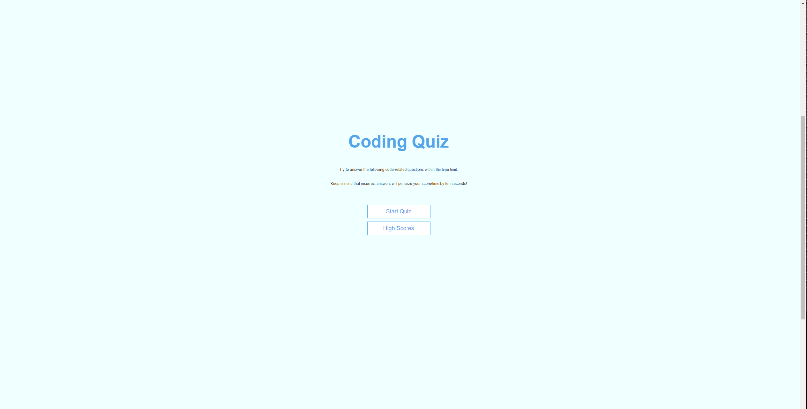

# Title: WC6_JSQuiz

Working with Web APIs: Code Quiz app 

## Project Lead: Wojciech J. Koloska

This timed quiz was created to fulfill 6th Bootcamp chalenge.
This chalenge was targetting JS skills and ability to work with API's.
This app will run in the browser, and will feature dynamically updated HTML and CSS powered by JavaScript code. 
"Commented" test points were left in addition to standard comments in JS file;
allowing future tracebility of logic in the code , as In the future I would like recreate 
same application using different style/methods (ex. jquery syntax to improve the code).

## Source Code and Web link

This source code is available to everyone under the standard MIT license.

This project is available under below link: https://w-jk.github.io/WC6_JSQuiz/

Code can be accesset also on Git Hub from the below repository:
 https://github.com/W-JK/WC6_JSQuiz.git

## Credits

https://www.w3schools.com/
https://blog.shahednasser.com/how-to-style-an-audio-element/
https://www.oreilly.com/library/view/dom-enlightenment
https://techstacker.com/display-javascript-objects-in-html/

## License

Licensed under the MIT license. 
Part of the source code was suplied and is licenced under: 
© 2023 edX Boot Camps LLC. Confidential and Proprietary. All Rights Reserved.
